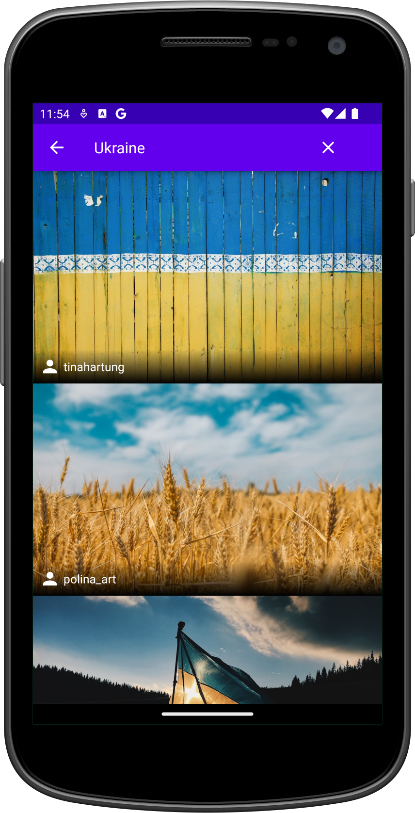

# Online Images

## Project Description

The Online Images project is a sample Android application demonstrating the ideal usage of Hilt,
Retrofit, and Pagination. The app fetches images from the Unsplash API and displays them in a
gallery. Users can tap on an image to view it in full screen along with the author's name. The
main screen also features a search bar to search for images based on user input. This project is
primarily educational, showcasing how to use these libraries effectively and handle process death
with SavedStateHandle in the ViewModel.

## Features

- **Gallery Screen**: Displays a grid of online images from the Unsplash API.
- **Image Details**: Tap on an image to view it in full screen with the author's name.
- **Search Functionality**: Search for images using the search bar.
- **Pagination**: Infinite scrolling to load more images.
- **Handling Process Death**: Demonstrates handling process death with SavedStateHandle in the
  ViewModel.

## Installation Instructions

1. Download the project.
2. Open the project in Android Studio.
3. Run the project from Android Studio.
4. Install the app on an emulator or physical Android device.

## Usage

Once installed, the application can be used to explore images from the Unsplash API. The primary
purpose of the app is educational, demonstrating the usage of Retrofit with Hilt and infinite
pagination.

## Technologies Used

- **Hilt**: Dependency injection library.
- **Retrofit**: HTTP client for making API requests.
- **Pagination**: `androidx.paging:PagingSource` for infinite scrolling.
- **Glide**: Image loading library.
- **Navigation**: `androidx.navigation:navigation-fragment-ktx`
  and `androidx.navigation:navigation-ui-ktx`.

## Contributing

Anyone can contribute by creating a pull request with changes. Contributions are welcome, although
the app is primarily for educational purposes.

## Credits

This project is inspired by the
[ImageSearchApp](https://github.com/codinginflow/ImageSearchApp/tree/Part-13_Handling-Process-Death)
by [Coding in Flow](https://github.com/codinginflow).

## License

This project does not have an intentional license.

### Screenshots:

<!--suppress CheckImageSize -->

